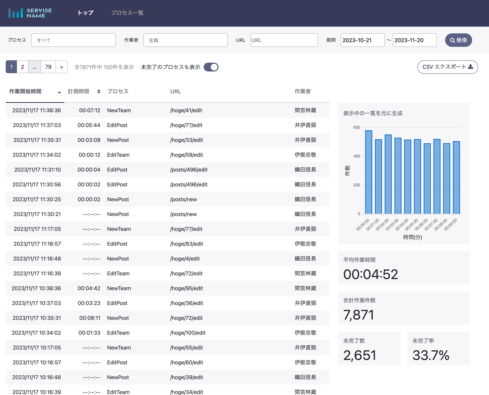
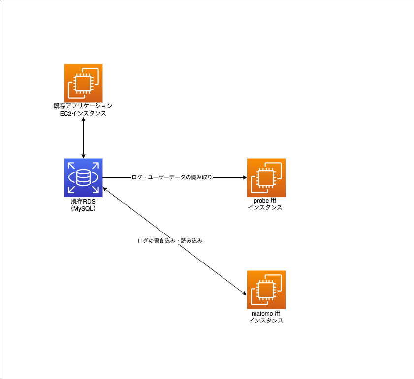

# 概要
[オープンソースのWeb解析プラットフォーム Matomo](https://matomo.jp/) のタグ機能を利用し、
対象のWebアプリケーションの特定の地点間のユーザー操作所要時間を計測します。
ユーザーIDをMatomoと紐づけることにより、ユーザー名の表示が可能です。
タグの収集にはMatomoを利用し、データ表示にはRuby on Railsを使用しています。

# Demo
  

# 想定される構成
  - 既存のDB(MySQL)にMatomoログデータを収集する
    - 既にMatomoを導入している場合
    - 新規にMatomoを導入し、既存のDBを利用する場合

  

# 導入方法
- doker-composeを使用した起動
  - [計測対象アプリケーションとdockerネットワークの接続](app/docs/network_config.md)
  - [環境変数の用意](app/docs/environment.md)
  - [計測対象アプリケーションへタグを設置する](app/docs/installation_tags.md)

  matomoの設定については [matomo日本語情報発信サイト](https://matomo.jp/)をご確認ください。

以上の設定を終えた後、計測対象アプリケーションと本アプリケーションを`docekr-compose up`で起動してください。

## 認証について
本アプリケーションは認証機能が付いておりません。
適宜Basic認証等の認証を設けての運用を推奨します。
